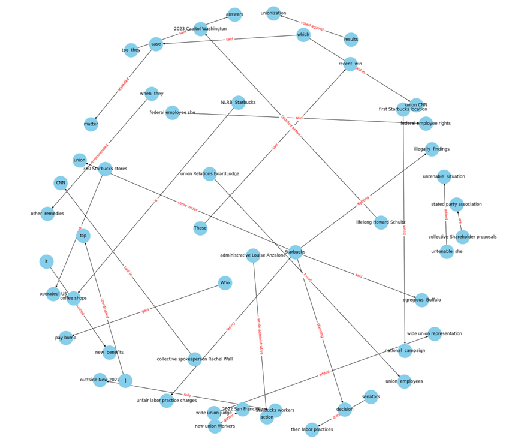
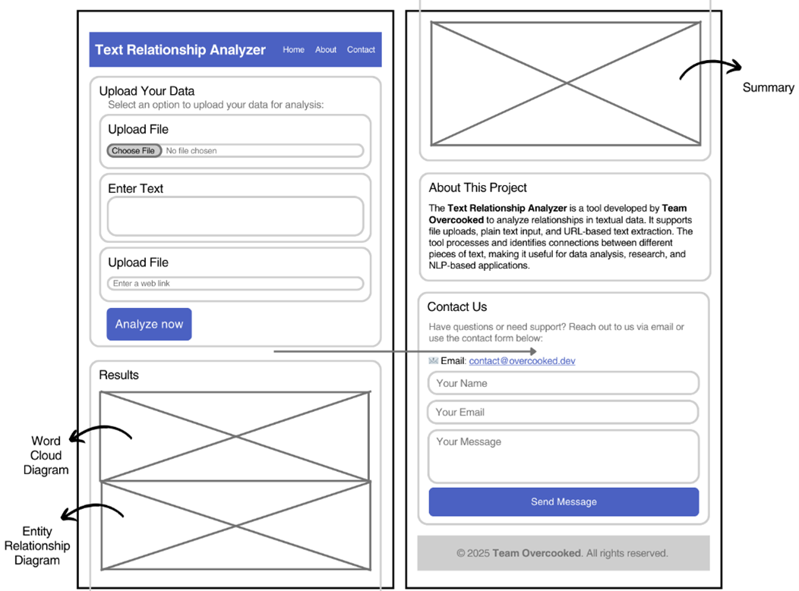
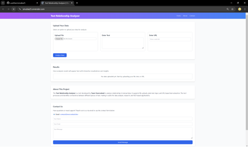
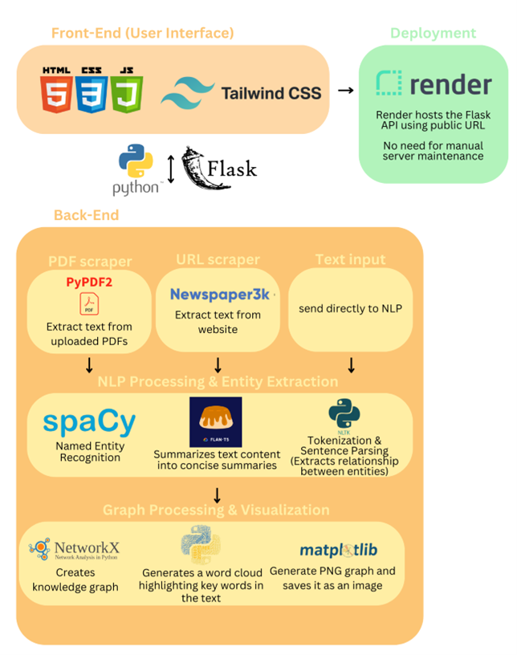

# Entity Relationship Diagram and Word Cloud Generator

## Overview
Our solution is a web application designed to extract relationships between entities from text, supporting input in the form of PDFs, public URLs, or plain text. With a few clicks, users can upload their files into the website and generate two powerful visualizations: an **Entity Relationship Diagram (ERD)** and a **Word Cloud (WC)**.

## Key Features
From the Entity Relationship Diagram, users can easily identify **key concepts, themes, and relationships** within their text. The diagram reveals insights into relationships between entities, represented as directional arrows, highlighting causal or hierarchical relationships. The Word Cloud, on the other hand, provides a snapshot of key themes and topics through word frequency analysis, helping users quickly identify recurring patterns and trends for **sentiment analysis** and **thematic understanding**.

## Functionality
The solution efficiently extracts, analyzes, and visualizes relationships within unstructured text. It supports various input formats such as PDFs, raw text, and website URLs, ensuring versatility for different user needs. By leveraging **pre-trained models**, the system accurately identifies key entities, including people, organizations, and locations. Relationships are identified through verb and prepositional pattern matching, structuring the extracted relationships into a dictionary format. This data serves as the basis for generating an **entity network graph**.

## Deployment and Scalability
The system is deployed on **Render**, enabling automated deployment and continuous integration with **GitHub**. This setup ensures seamless updates, version control, and efficient resource management. The cloud-based deployment provides scalability, improved uptime, and a robust environment for running the application, making it adaptable to user demands.

## Value Proposition
Our solution’s value lies in its **user-friendly interface** and **broad file compatibility**. The intuitive design enhances accessibility and streamlines workflows, eliminating the need for tedious manual input. By combining simplicity with powerful analytical functionality, the tool empowers users to transform data into actionable insights. This makes it an indispensable tool for decision-making, research, and monitoring trends.

---
### Deployment Issues
We regret to inform that the website https://smubia25.onrender.com has faced issues with deployment of hte latest GitHub commit, please run the program on local host. All functions and expected output works locally but the deployed website remains at one of the ealier versions of the solution.